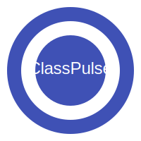

# ClassPulse Documentation

{: .center style="max-width:200px" }

## What is ClassPulse?

ClassPulse is a real-time audience interaction tool that allows presenters to engage with their audience through interactive questions and live visualizations. Similar to platforms like Mentimeter, ClassPulse enables presenters to create various question types and audience members to respond using a simple web interface.

## Key Features

- **Multiple Question Types**
  - Multiple Choice Questions (visualized as bar charts)
  - Word Cloud Questions (for gathering text responses)
  - Rating Scale Questions (1-5 or custom scale)

- **Real-time Results**
  - Live updating visualizations
  - WebSocket-based communication
  - No page reloads required

- **Simple Audience Join**
  - 6-digit session codes
  - QR code support
  - No account required for audience members

- **Data Export**
  - Export results as CSV
  - Individual question or entire session export

## About This Documentation

This documentation provides comprehensive information about ClassPulse, from installation and basic usage to technical details and development guides. Use the navigation menu to explore different sections.

- **Getting Started**: Installation and basic usage guide
- **Architecture**: System architecture and components
- **Technical Specification**: Detailed requirements and specifications
- **Developer Guide**: Guide for developers working with the codebase
- **Data Flow**: Visual representation of data flows through the system
- **API Reference**: Complete reference of all APIs and functions

## Tech Stack

ClassPulse is built with:

- **Backend**: Python with FastHTML framework
- **Frontend**: HTML, CSS, JavaScript
- **Database**: SQLite with FastLite ORM
- **Real-time**: WebSockets
- **Visualizations**: Chart.js and jQCloud

## License

ClassPulse is released under [choose an appropriate license]

## Contributing

We welcome contributions to ClassPulse! See our [Getting Started](GETTING_STARTED.md) guide for information on setting up your development environment.
